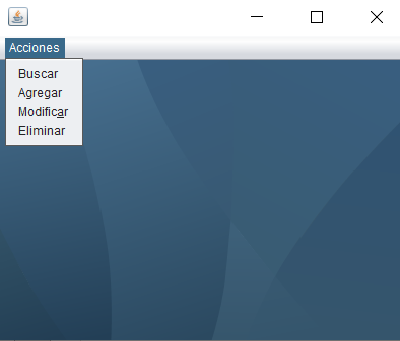

# CRUD con MYSQL.

Se desarrollo un programa con un formulario de registro en donde se muestran controles
para lo diferentes campos de información, una tabla en la parte inferior de la ventana y los
botones para agregar, borrar y modificar la información tanto en la tabla (JTable) como en
la base de datos.

# Prerequisitos.

IDE que use lenguaje Java.

Al usuar la conexion que nos provee nuestro docente (FreeMySQLHosting) causaba algunas limitaciones y problemas.

# Instalacion.

1.- Se necesita descargar el ZIP del repositorio.

2.- Extraer los ficheros del ZIP en tu computadora o terminal.

3.- Abrir el IDE de preferencia y enlazar tu proyecto.

4.- Se necesitara de una libreria externa para poder usar el proyecto, denominada my sql connector java.

https://dev.mysql.com/downloads/connector/j/

# Elementos visuales y funcionamiento.

1.- Se uso un manejador el cual cuenta con un JMenu que cuenta con diferentes Items que realizan las opciones de "Buscar" , "Agregar" , "Modificar" y "Elimniar".

2.- En el apartado de agregar y guardar usuario se usaron diferentes formularios y tablas para mostrar a los usuarios y el boton para agregarlos.

3.- En el apartado de modificar, se agrego lo mismo, solo que se tienen dos botones, uno para guardar y otro para modificar usuarios.

4.- Se muestra una tabla en el apartado de eliminar, se tiene que seleccionar la tupla y se elimina atraves del boton.

5.- En el apartado de buscar, se muestra una tabla de todos los registros y una opcion para poder buscar a nuestros usuarios a traves de un boton.

# Agradecimientos.

 A nuestro docente por alentarnos, ayudarnos en algunas dudads y a mi por esforzarme.
 
# Referencias.

https://dev.mysql.com/downloads/connector/j/

https://docs.oracle.com/javase/7/docs/api/javax/swing/JTable.html

https://www.youtube.com/watch?v=nbAYB6HyTQI&ab_channel=Ingenier%C3%ADadeSistemas

# Construido en.

IDE Neat Beans 8.2. 

Free MySQL Hosting para la base de datos remota.

# Resultados.

